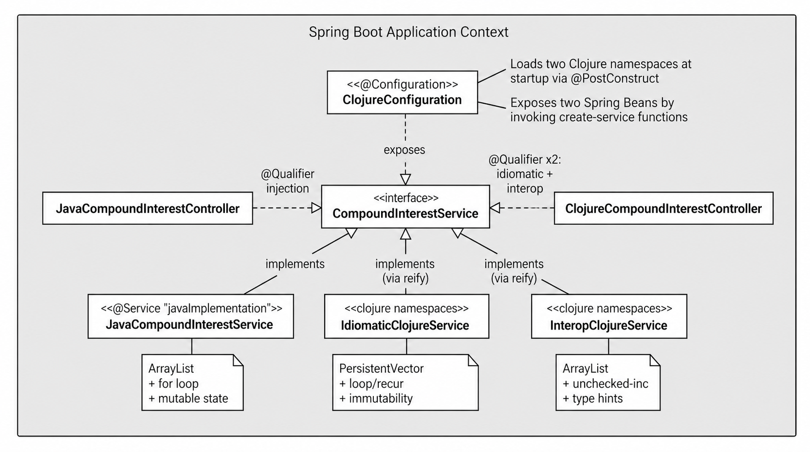
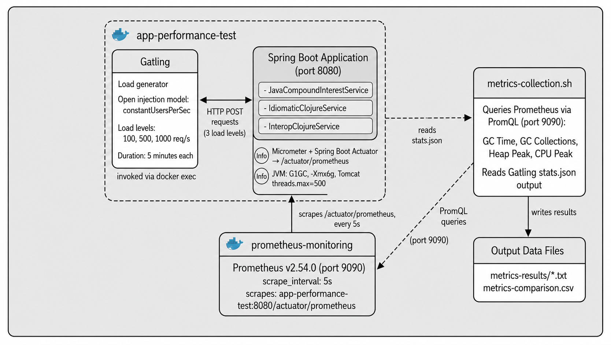

# Performance Analyzer: Programming Paradigms Comparison

## Academic Context

**Title:** Cost of Idiomatic Abstractions on the JVM: A Quantitative Study Comparing Java and Clojure Implementations in HTTP Request Processing

**Author:** Nathan Paiva  
**Advisor:** Juliano Zanuzzio Blanco  
**Institution:** IFSP — Federal Institute of São Paulo, Piracicaba Campus  
**Program:** Computer Engineering  
**Year:** 2026

## Paper

The full text of the study is available at: [`docs/article-nathan-paiva.pdf`](docs/article-nathan-paiva.pdf)

## Test Data

The complete raw results from the three independent test rounds (V1, V2, V3) are available at:
[`data-v1-v2-v3/TEST-V1.xlsx`](data-v1-v2-v3/TEST-V1.xlsx), [`data-v1-v2-v3/TEST-V2.xlsx`](data-v1-v2-v3/TEST-V2.xlsx), [`data-v1-v2-v3/TEST-V3.xlsx`](data-v1-v2-v3/TEST-V3.xlsx)

Each workbook contains a Raw Data sheet with all executions (including discarded ones) and separate analysis sheet(s) documenting the exclusion criteria (qualitative invalidity and z-score outlier detection) applied to reach the definitive dataset for each load level. See [Performance Testing Workflow](#performance-testing-workflow) for the full methodology behind each round.

## Overview
Comparative performance study between programming paradigms through a REST API that calculates compound interest. The project implements three distinct approaches:

- **Java (OOP)**: Pure object-oriented implementation using imperative style with mutable `ArrayList`
- **Clojure Idiomatic (FP)**: Pure functional implementation with immutable `PersistentVector` data structures
- **Clojure Interop Java (Hybrid OOP+FP)**: Strategic Java interoperability using native `ArrayList` within Clojure syntax

## Research Objective
Measure and compare quantitatively the performance cost of Clojure's idiomatic abstractions versus Java in HTTP request processing on the JVM, and investigate the role of Garbage Collector behavior as the mediating mechanism between paradigm choice and observed latency. The central finding of the study is that Java exhibits structural instability under saturation at 1000 req/s (CV% ~31%), while both Clojure implementations show convergent latency with greater stability (CV% ~13–15%). The generational hypothesis — that Clojure Idiomatic's short-lived immutable objects align with the design assumptions of generational GC — is the explanatory framework, not a claim of Clojure superiority.

## Architecture

The two diagrams below are Figures 1 and 2 of the paper. Click either one to open it at full size.

**How the three implementations share one contract.** `ClojureConfiguration` loads the two Clojure namespaces at startup and exposes them as Spring beans, so the Java service and both Clojure services implement the same `CompoundInterestService` interface. Any difference measured in the load tests comes from the paradigm, not from the HTTP layer or the contract:

<p align="center"><a href="docs/architecture-components.png"></a></p>

**The test environment.** Two containers: the application, which also runs Gatling through `docker exec`, and Prometheus. On the host, `metrics-collection.sh` drives each execution, queries Prometheus over PromQL and consolidates the numbers:

<p align="center"><a href="docs/architecture-test-environment.png"></a></p>

### Project Structure
```
src/
├── main/
│   ├── java/.../
│   │   ├── config/
│   │   │   ├── ClojureConfiguration.java      # Clojure-Spring integration
│   │   │   └── SwaggerConfig.java
│   │   ├── controllers/
│   │   │   ├── JavaCompoundInterestController.java
│   │   │   └── ClojureCompoundInterestController.java
│   │   ├── services/
│   │   │   ├── CompoundInterestService.java   # Interface
│   │   │   └── JavaCompoundInterestService.java
│   │   ├── models/
│   │   │   ├── request/CompoundInterestRequest.java
│   │   │   └── response/...
│   │   └── exceptions/
│   │
│   ├── clojure/.../service/
│   │   ├── compound_interest_service_idiomatic.clj
│   │   └── compound_interest_service_interop_java.clj
│   │
│   └── resources/
│       └── application.properties
│
└── test/javaGatling/.../performance/
    └── CompoundInterestSimulation.java        # Load testing configuration
```

### Repository Layout

| Path | What it holds |
|---|---|
| `src/` | The three implementations and the Gatling simulation |
| `scripts_shell/` | The tooling of the experiment: `metrics-collection.sh` and `run-gatling.sh` drive an execution, `bytecode-analysis*.sh` extract the bytecode, `test-prometheus-queries.sh` checks the PromQL queries |
| `data-v1-v2-v3/` | The raw results of the three rounds, one workbook each |
| `metrics-results/` | The consolidated metrics, one folder per round (`v1`, `v2`, `v3`) and inside it one folder per implementation and load level |
| `bytecode-analysis/` | The bytecode of each implementation, extracted with `javap -c -p`, and the two comparative analyses behind the instruction counts reported in the paper |
| `monitoring-configs/` | The Prometheus and Grafana configuration |
| `docs/` | The paper and the two diagrams above |

`gatling-results/`, `heap-dumps/` and `maven-cache/` are produced by the runs and are not versioned.

### Monitoring Stack
- **Prometheus**: JVM metrics collection (CPU, heap, GC)
- **Grafana**: Real-time visualization
- **Gatling**: Load testing and latency analysis
- **Docker Compose**: Isolated test environments

## Technologies
- **Java 17** + **Clojure 1.11.1**
- **Spring Boot 3.4.5** (Web, Validation, Actuator)
- **Gatling 3.9.5** (Performance testing)
- **Prometheus + Grafana** (Metrics)
- **Docker Compose** (Containerization)
- **Maven** (Build)

## Prerequisites
- Java 17+
- Docker & Docker Compose
- Git

Maven itself is not needed: `./mvnw` is in the repository, and the load tests run inside the application container.

## Quick Start

### 1. Clone Repository
```bash
git clone https://github.com/nathan00pdl/java-clojure-performance-analyzer.git
cd java-clojure-performance-analyzer
```

### 2. Run with Docker
```bash
docker compose up -d
```

### 3. Verify Health
```bash
curl http://localhost:8080/actuator/health
```

### 4. Access Interfaces
- **API**: http://localhost:8080
- **Swagger**: http://localhost:8080/swagger-ui.html
- **Prometheus**: http://localhost:9090
- **Grafana**: http://localhost:3000 (admin/admin123)

## API Endpoints

### Java Implementation
```bash
POST /api/compound-interest-java/calculate
Content-Type: application/json

{
  "initialAmount": 10000.0,
  "annualInterestRate": 10.0,
  "years": 100
}
```

### Clojure Idiomatic
```bash
POST /api/compound-interest-clojure/calculate-idiomatic
```

### Clojure Interop Java
```bash
POST /api/compound-interest-clojure/calculate-interop-java
```

### Response Structure
```json
{
  "summary": {
    "initialInvestment": 10000.0,
    "finalBalance": 137806123.40,
    "totalInterestEarned": 137796123.40
  },
  "yearlyDetailsList": [
    {
      "year": 1,
      "startBalance": 10000.0,
      "endBalance": 11000.0,
      "interestEarned": 1000.0
    }
  ]
}
```

## Performance Testing Workflow

This project follows a rigorous testing methodology to ensure reliable, reproducible results for academic analysis. The study comprised **three independent test rounds** (V1, V2, V3), each organized as 3 implementations × 3 load levels × up to 7 repetitions per group.

- **V1 (initial round, 54 executions)**: Used as historical reference for 100 and 500 req/s. A bug was identified in the `metrics-collection.sh` script where PromQL queries for GC Time and GC Collections used `result[0]`, capturing only one G1GC series instead of the sum of all. This caused underestimation of absolute GC values. Relative ordering between implementations was preserved.
- **V2 (corrected round, 54 executions)**: Conducted with the corrected script (replacing `result[0]` with `[.data.result[].value[1] | tonumber] | add // 0`). Constitutes the definitive data for 100 and 500 req/s.
- **V3 (dedicated round, 21 executions)**: Dedicated exclusively to 1000 req/s, motivated by instability observed in V2 at that load level (4 collapses across 18 executions). Constitutes the definitive data for 1000 req/s.

Executions were excluded under two independent criteria:
1. **Qualitative invalidity**: error rate > 0% — sufficient condition for discard regardless of other metrics.
2. **Statistical outliers**: z-score criterion (|z| > 2) applied over the P95 latency metric.

Each execution ran in a fully fresh container. Between consecutive executions, the environment was completely reset (`docker compose down -v && docker system prune -f && docker volume prune -f`) followed by a clean restart of the application. A minimum 300-second stabilization interval was observed before each new execution to allow thermal and OS-level resource stabilization. This guarantees that each execution starts from a virgin heap state with no JIT warm-up carried over from previous runs, making executions statistically independent.

### Test Configuration

Edit the Gatling simulation to configure your test scenario:
```java
// src/test/javaGatling/.../CompoundInterestSimulation.java

setUp(
    scenarioJava.injectOpen(                                    // Choose scenario
        constantUsersPerSec(100).during(Duration.ofMinutes(5))  // Load configuration
    )
).protocols(httpProtocol);
```

**Available scenarios:**
- `scenarioJava` - Java OOP implementation
- `scenarioClojureIdiomatic` - Clojure FP implementation
- `scenarioClojureInteropJava` - Hybrid implementation

### Step-by-Step Testing Protocol

#### 1. Configure Test Scenario
```bash
# Edit CompoundInterestSimulation.java to select implementation and load
vim src/test/javaGatling/com/example/java_clojure_performance_analyzer/performance/CompoundInterestSimulation.java
```

#### 2. Build Application (if code changed)
```bash
docker compose build app
```

#### 3. Clean Environment
```bash
docker compose down -v && docker system prune -f && docker volume prune -f
```

#### 4. Start Services and Verify Health
```bash
docker compose up -d app prometheus && until curl -sf http://localhost:8080/actuator/health > /dev/null; do sleep 2; done && echo "App ready"
```

#### 5. Verify Test Configuration
```bash
grep -A 5 "setUp" src/test/javaGatling/com/example/java_clojure_performance_analyzer/performance/CompoundInterestSimulation.java | grep -v "//"
```

#### 6. Check System Baseline
```bash
# CPU idle percentage (should be > 95%)
mpstat 1 1 | awk '/Average:/ {print "CPU idle:", $NF "%"}'

# Available RAM percentage (should be > 75%)
free | awk '/^Mem:/ {printf "Available RAM: %.1f%%\n", ($7/$2)*100}'

# Top processes overview
top -b -n 1 | head -n 20
```

#### 7. Run Test with Metrics Collection

**Terminal 1** — start metrics collection:
```bash
./scripts_shell/metrics-collection.sh <implementation> <load>
```

| Parameter | Options |
|---|---|
| `<implementation>` | `java` · `clojure-idiomatic` · `clojure-interop-java` |
| `<load>` | `100` · `500` · `1000` |

Example:
```bash
./scripts_shell/metrics-collection.sh java 1000
```

**Terminal 2** — execute load test when prompted:
```bash
./scripts_shell/run-gatling.sh
```

Return to Terminal 1 and press ENTER after Gatling finishes.

#### 8. Wait for System Stabilization
```bash
sleep 300  # 5 minutes between tests
```

#### 9. Reset Environment and Repeat
```bash
docker compose down -v && docker system prune -f && docker volume prune -f && docker compose up -d app prometheus && until curl -sf http://localhost:8080/actuator/health > /dev/null; do sleep 2; done && echo "App ready"
```

Repeat steps 5-9 for each execution, changing the scenario in `CompoundInterestSimulation.java` and the argument to `scripts_shell/metrics-collection.sh` when switching implementations.

### Verify Results
```bash
# List generated Gatling reports
ls -lt gatling-results/

# View latest metrics (example for V3)
cat metrics-results/v3/metrics-comparison.csv

# Check the executions of one implementation at one load level
ls metrics-results/v3/java_load_1000/
cat metrics-results/v3/java_load_1000/1000_java_1.txt

# List all available rounds
ls metrics-results/
```

## Metrics Collected

### Prometheus Metrics
All Prometheus metrics are calculated as the delta between the initial value (collected before the test starts) and the final value (collected after a 25-second synchronization wait post-Gatling), isolating consumption attributable exclusively to the test period.

- **CPU Peak**: Maximum CPU usage during test
- **Heap Peak**: Maximum heap memory allocation (GB and % of configured 6GB max)
- **GC Time**: Total garbage collection pause time (`jvm_gc_pause_seconds_sum`)
- **GC Collections**: Number of GC cycles (`jvm_gc_pause_seconds_count`)
- **Total Requests**: HTTP requests processed

### Gatling Metrics
- **Response Time**: Min, Mean, P50, P75, P95, P99, Max (ms)
- **Throughput**: Requests per second
- **Success Rate**: Percentage of successful requests (executions with error rate > 0% are discarded)
- **Error Breakdown**: Detailed classification of failure types (timeouts, connection refused, premature close)

P95 and P99 are the primary latency metrics, as they capture tail behavior under sustained load and are most sensitive to GC pause impact.

### Results Storage
- **Text Reports**: `metrics-results/{version}/{implementation}_load_{load}/{load}_{implementation}_{execution}.txt`
- **CSV Dataset**: `metrics-results/{version}/metrics-comparison.csv`
- **Gatling HTML**: `gatling-results/compoundinterestsimulation-{timestamp}/`

## Paradigm Implementations

### Java (Imperative/OOP)
```java
List<YearlyInvestmentSummary> yearlyDetailsList = new ArrayList<>(years);
double currentAmount = initialAmount;

for (int year = 1; year <= years; year++) {
    final double endBalance = currentAmount * compoundFactor;
    yearlyDetailsList.add(new YearlyInvestmentSummary(...));
    currentAmount = endBalance;
}
```

**Characteristics**: Mutable state, traditional loops, single `ArrayList` instance mutated in place, arithmetic on primitive `double`/`int` types — no intermediate object versions created per iteration.

### Clojure Idiomatic (Functional)
```clojure
(loop [year 1
       current-amount initial-amount
       yearly-details-list []]
  (if (> year years)
    yearly-details-list
    (recur (inc year)
           end-balance
           (conj yearly-details-list ...))))
```

**Characteristics**: Immutable `PersistentVector` expanded via `conj` at each iteration, producing intermediate object versions that become GC-eligible immediately. Arithmetic intermediated by `clojure.lang.Numbers` (56 `invokestatic` calls per request vs. Java's 7). Higher GC pressure across all load levels, but this does not translate into latency penalties in stable executions.

### Clojure Interop Java (Hybrid)
```clojure
(let [^ArrayList yearly-details-list (ArrayList. years)
      final-amount
      (loop [year 1
             current-amount initial-amount]
        (.add yearly-details-list ...)
        (recur (unchecked-inc year) end-balance))]
  ...)
```

**Characteristics**: Native Java `ArrayList` with `^ArrayList` type hint (eliminates runtime reflection), `unchecked-inc` for overflow-check-free counter increment, explicit primitive coercions. Allocation pattern approximates Java imperative. Retains Clojure runtime infrastructure for type conversion operations.

## Input Validation
- `initialAmount`: ≥ 0
- `annualInterestRate`: > 0
- `years`: > 0 and ≤ 200

## Configuration

### JVM Tuning (docker-compose.yml)
```yaml
JAVA_OPTS: >-
  -Xms4g
  -Xmx6g
  -Xss512k
  -XX:MaxMetaspaceSize=512m
  -XX:+UseG1GC
  -XX:MaxGCPauseMillis=200
  -XX:+ParallelRefProcEnabled
  -XX:+UseStringDeduplication
  -XX:+UseCompressedOops
  -XX:+HeapDumpOnOutOfMemoryError
  -XX:HeapDumpPath=/app/heap-dumps
```

### Tomcat Configuration (application.properties)
```properties
server.tomcat.threads.max=500
server.tomcat.max-connections=20000
server.tomcat.accept-count=1000
```

### Prometheus Scraping (monitoring-configs/prometheus.yml)
```yaml
scrape_interval: 5s
evaluation_interval: 5s
scrape_timeout: 4s
```

## Troubleshooting

### Container Not Healthy
```bash
# Check logs
docker logs app-performance-test

# Restart services
docker compose restart app
```

### Prometheus Not Scraping
```bash
# Verify endpoint
curl http://localhost:8080/actuator/prometheus

# Check Prometheus targets
curl -s http://localhost:9090/api/v1/targets | grep -o '"health":"[a-z]*"'
```

### Gatling Fails to Execute
```bash
# Ensure app is healthy first
curl http://localhost:8080/actuator/health

# Check container resources
docker stats app-performance-test
```

## License
Licensed under the [MIT License](LICENSE). The paper in `docs/` is the author's academic work.

## Author
Nathan Paiva — Bachelor's Thesis in Computer Engineering, IFSP Piracicaba, 2026  
Advisor: Juliano Zanuzzio Blanco